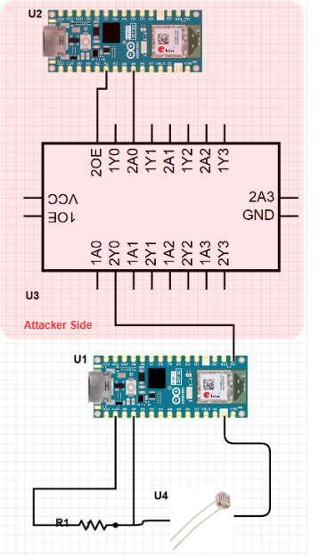

# Probing Attack Demo Project for Research Experience for Undergraduate Interns (WSU Smart Lab)
In this project, a probe attack is demonstrated to menupulate or inject data into UART bus with attacker hardware (supposetly hardware trojan equavalent). This repository containts firmware for both - attacker and victim.

The victim hardware reads the value of Light Dependent Resistor (LDR) with it's Analog to Digital Converter (ADC) peripherial. Then, it sends the ADC value over UART. The Transmission (TX) bus can be accessed from the TX0 or TX labeled in Arduino or ESP32 modules. 

The attacker hardware consists of a Microcontroller (operating volage must match victim's) and a Line Driver IC. The IC can be configured in three states - Floating, Low and High. In floating mode, the sytem is left uninterrupted. Otherwise, the line is driven either HIGH or LOW.
Attacker Hardware can select mode. When the logic 1 is provided, the output of IC is in Floating Mode. For logic level 0, the IC outputs whatever logic level is provided to the input pin of the IC.

## Circuit Diagram

(All grounds must be commoned)
